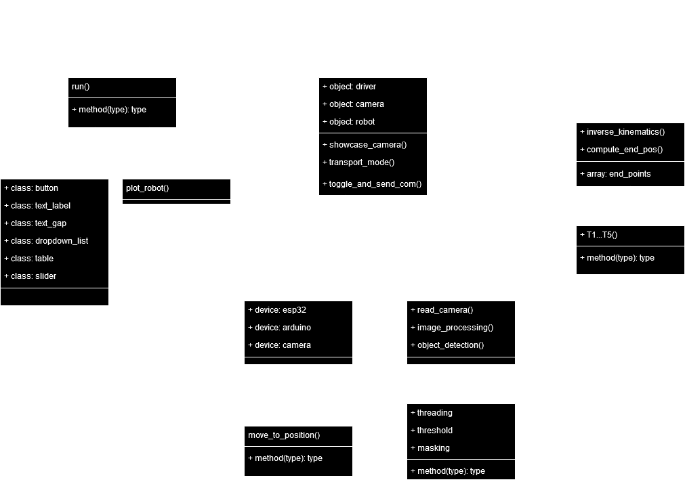
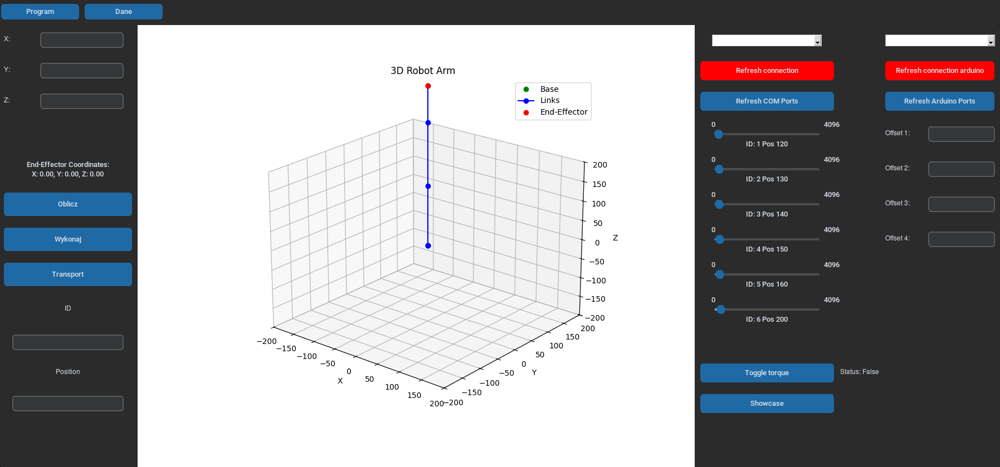

 

### Projekt manipulatora podwodnego w ramach projektu FutureLab.

---

## Spis treści

1. [Uruchomienie](#startup)
    - [Pobranie plików](#startup1)
    - [Kopiowanie do Jetsona](#startup2)
    - [Uruchomienie](#startup3)
2. [Biblioteki](#dependencies)
3. [Struktura programu](#model)
4. [Zrzuty ekranu](#screenshots)

## 1. Uruchomienie

<a name="startup"></a>

Pierwszym krokiem jest przygotowanie kluczy znajdujących się w folderze [`utils/ssh/`](/utils/ssh).
Proces wgrania kluczy znajduje się w [tym poradniku](/docs/connect-to-jetson-ssh.md).


### 1.1 Pobranie plików na maszynie lokalnej

<a name="startup1"></a>

- Opcja pierwsza, jeżeli planujemy późniejsze modyfikowanie kodu i wgrywanie na repozytorium:

```shell
mkdir futurelab_robot && cd futurelab_robot
git init
git remote add origin git@github.com:zarool/futurelab_robot.git # konieczne jest przygotowanie klucza SSH do GitHub
git pull --rebase origin main
```
W celu wgrania nowych zmian należy wrzucić projekt na nowy branch
```shell
git checkout -b new-feature # utworzenie nowego brancha
git add .
git commit -m "Added new feature"
git push origin main
```

- Opcja druga, jeżeli chcemy wgrać sam kod

```shell
git clone https://github.com/zarool/futurelab_robot
```

### 1.2 Wgranie plików do Jetsona

<a name="startup2"></a>

```shell
cd futurelab_robot
utils/copy.sh

# Opcjonalnie można podać klucz SSH do połączenia z Jetsonem:
utils/copy.sh ~/.ssh/jetson
```

### 1.3 Uruchomienie programu na Jetsonie

<a name="startup3"></a>

```shell
cd podwodny
python3 src/main.py
```


## 2. Użyte biblioteki

<a name="dependencies"></a>

| Nazwa         | Wersja           |
|---------------|:----------------:|
| JetPack       | 6.0 [L4T 36.3.0] |
| CUDA          | 12.2.140         |
| cuDNN         | 8.9.4.25         |
| CUDA GPU Arch | 8.7              |
| OpenCV        | 4.9.0            |
| GStreamer     | 1.20.3           |
| Python        | 3.10.12          |

>*__PRZYDATNE__* </br>
>Do sprawdzenia aktualnych wersji bibliotek i firmware'u w terminalu wpisz `jetson_release`

## 3. Struktura programu

<a name="model"></a>

</img>

Dokładny opis klas oraz ich funkcji został opisany w [dokumentacji](docs/documentation.md)

## 4. Zrzuty ekranu

<a name="screenshot"></a>

Podstawowa wersja GUI programu.

</img>
